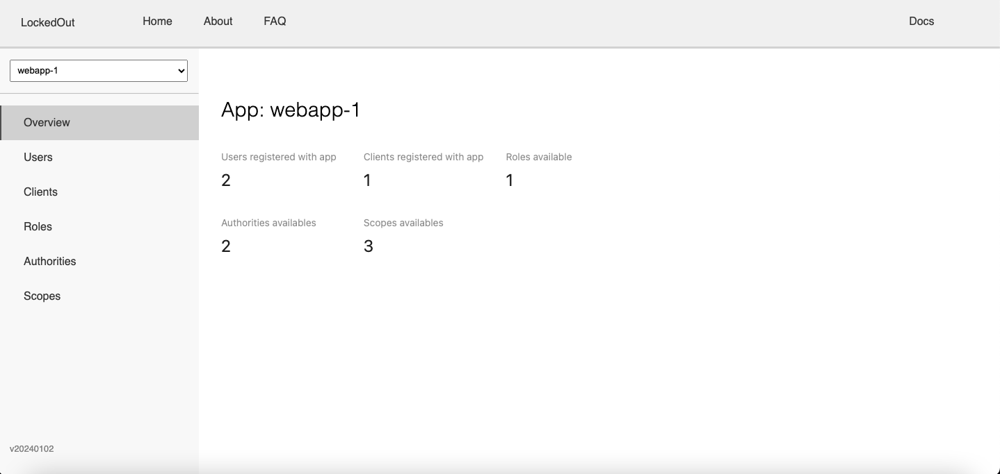

# LockedOut

### Purpose

LockedOut is a authorization server that utilises the OAuth2.0 & OIDC protocol. LockedOut can be used in applications to support authentication & authorization. A user interface, can also be used to CRUD users/OAuth2.0 clients apps.

### Demo

Click screenshot to view walkthrough of LockedOut

[](https://youtu.be/2qv0FWRXvbk)

### Architecture overview

```
|----------|
| Frontend | -------------
|----------|             ↓
                 |--------------| -----> |------------|
                 | Identity API |        | PostgreSql |
                 |--------------| <----- |------------|    
|----------|             ↑
| Auth API | -------------
|----------|
```

- The `Frontend` web app can be used to manage/CRUD users & OAuth clients.
- The `Auth service API` is responsible for authenticating users & OAuth2.0 clients. It has a heavy dependency on the `Identity service API`.
- The `Identity service API` performs most of the CRUD operations & directly interacts with the Postgres database.

### Integrating with your app

Since LockedOut is a authorization server. It provides no use alone. It will need to be integrated with a frontend app or resource server that needs protection.

```
|----------| -----> |-----------|
| Resource |        | LockedOut |
|----------| <----- |-----------|
```

The `Resource` represents your API or frontend app, you would like to protect. `LockedOut` is what you see in the <i>Architecture overview</i> heading. Essentially your API will call LockedOut and will authenticate a user. Fine grained roles & authorities can also be set in LockedOut to authorize requests.

For detailed information on how to integrate with your project, please see the docs in the LockedOut frontend web app.

### Running

Ensure ports: 3000, 5432, 8080, 8081 are available.

Start the application using Docker Compose. Ensure you are inside the `docker-compose` folder.

```
docker compose -f docker-compose.dev.yml up -d
```
